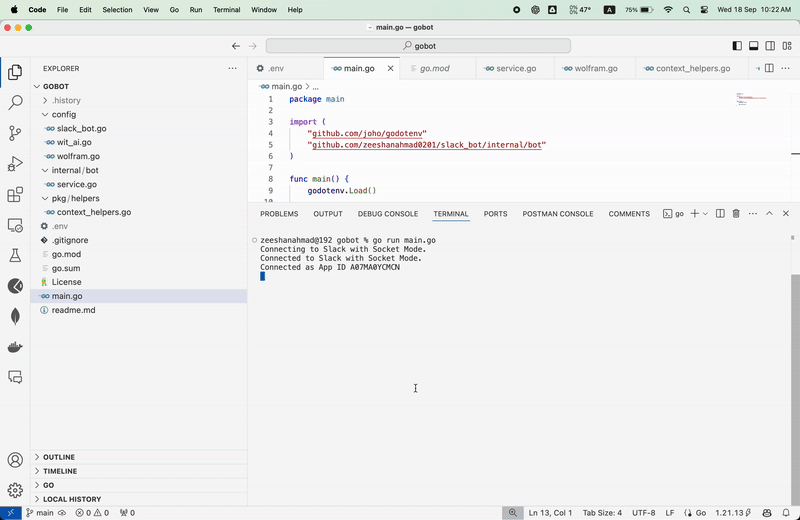

# Slack Bot with Wit.AI and Wolfram

A Slack bot built with Go that integrates with Wit.AI and Wolfram Alpha to provide dynamic answers to user questions.



## Features

- **Command Handling**: Responds to user commands in Slack.
- **Natural Language Processing**: Utilizes Wit.AI for understanding user queries.
- **Intelligent Responses**: Fetches answers from Wolfram Alpha based on user questions.

## Getting Started

### Prerequisites

- Go (1.21.13 or higher)
- Slack API Token
- Wit.AI API Token
- Wolfram Alpha App ID

### Installation

1. **Clone the repository**:

   ```bash
   git clone https://github.com/zeeshanahmad0201/slack_bot.git
   cd slack_bot
   ```
2. **Install dependencies**:

   ```bash
   go mod tidy
   ```
3. **Set up environment variables**:
   Create a `.env` file in the root directory with the following content:

   ```bash
   SLACK_BOT_TOKEN=your_slack_bot_token
   SLACK_APP_TOKEN=your_slack_app_token
   WIT_AI_TOKEN=your_wit_ai_token
   WOLFRAM_APP_ID=your_wolfram_app_id
   ```
4. **Run the bot**:

   ```bash
   go run main.go
   ```
## Usage

- **Command Syntax**: `- <message>`
  
  Example: `- What is the capital of France?`

  The bot will parse the message, query Wit.AI for intent, and use Wolfram Alpha to provide an answer.

## Contributing

Feel free to open issues or submit pull requests to improve the bot. Contributions are welcome!

## License

This project is licensed under the MIT License - see the [LICENSE](./LICENSE) file for details.

## Acknowledgements

- [Wit.AI](https://wit.ai/) - Natural language processing
- [Wolfram Alpha](https://www.wolframalpha.com/) - Computational knowledge engine
- [Slack API](https://api.slack.com/) - Communication platform
